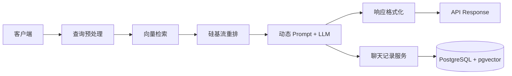

# Spring AI Alibaba 脚手架项目

> 基于 Spring Boot 3.4 与 Spring AI 的 RAG（Retrieval-Augmented Generation）示例工程，集成 DashScope、SiliconFlow、pgvector 与聊天记录管理能力，帮助团队快速落地企业级知识问答与多轮会话场景。

## 项目简介

本仓库提供的管线涵盖：查询预处理 → 向量检索 → SiliconFlow 重排 → 动态 Prompt 构建 → 通用 Chat 模型生成 → 响应格式化，并持久化完整的会话与检索上下文。配套的 `Makefile`、`docs/sql`、`docs/api` 与 `kanban/` 看板，帮助新成员完成数据准备、API 联调与需求推进。

## 核心特性

- **查询预处理**：`QueryPreprocessor` 统一噪声字符、别名替换，提升召回率。
- **向量检索 + 重排**：`RetrievalService` 基于 Spring AI pgvector 检索候选文档，并通过 SiliconFlow Rerank API 做结果排序与兜底。
- **动态 Prompt & Fallback**：`DynamicPromptBuilder` 使用 `resources/prompts/dynamic_prompt_template.txt` 渲染 persona/channel，`GenerationService` 在上下文不足或 LLM 异常时返回可配置的回退话术。
- **响应格式化**：`ResponseFormatter` 统一答案、引用文档、置信度与 `sessionId`，便于前端渲染引用列表。
- **聊天记录服务**：`ChatHistoryService` + `ChatHistoryController` 管理会话增删改查，`retrievalContext` 以 JSONB 存储，便于审计与复盘。
- **可插拔模型与配置**：开发阶段默认启用 `DeterministicEmbeddingModel`，生产可切换 SiliconFlow Embedding/Chat API，仅需调整环境变量。
- **工程化配套**：Logback 滚动日志、Spring Boot Actuator、`make lint/test/run`、`docs/sql` 中的建表脚本均已准备，可快速集成 CI/CD。

## RAG 架构流程



## 目录结构

```
.
├── docs/                  # PRD、API 说明、数据库脚本
├── kanban/                # 看板状态与任务记录
├── logs/                  # 应用运行日志目录（可由 LOG_HOME 覆盖）
├── src/
│   ├── main/java/com/example/springaialibaba/
│   │   ├── controller/    # Chat、RAG、聊天记录 REST API
│   │   ├── chat/          # 通用 Chat Client、聊天记录领域模型
│   │   ├── retrieval/、rerank/、embedding/、generation/ 等核心组件
│   │   └── preprocessor/prompt/formatter 等辅助模块
│   └── resources/
│       ├── application.yml、application-test.yml
│       ├── prompts/       # Prompt 模板
│       └── logback-spring.xml
├── Makefile               # 常用命令封装
├── pom.xml                # Maven 依赖与构建配置
└── README.md
```

## 快速开始

### 1. 环境准备

- JDK 17+
- Maven 3.9+
- PostgreSQL 15+，启用 `pgvector` 扩展
- DashScope / SiliconFlow / Generic Chat API 凭证（视需求配置）

### 2. 预下载依赖

```bash
make setup   # 预先缓存 Maven 依赖，便于离线构建
```

### 3. 启动本地数据库

```bash
docker run --name pgvector -p 5432:5432 \
  -e POSTGRES_USER=postgres -e POSTGRES_PASSWORD=postgres -e POSTGRES_DB=test \
  ankane/pgvector:0.5.1

# 初始化 Schema（将 docs/sql/schema.md 与 docs/sql/vector.md 中的 SQL 复制到 psql 中执行）
psql -h localhost -U postgres -d test
```

> ⚠️ `application.yml` 中配置 `spring.ai.vectorstore.pgvector.initialize-schema=true`，会在启动时尝试创建向量表。若生产环境已有表结构，请按需关闭。

### 4. 运行应用

```bash
export DASHSCOPE_API_KEY=<dashscope-key>
export GENERIC_CHAT_API_KEY=<generic-chat-key>
export SILICONFLOW_API_KEY=<optional-siliconflow-key>
make run
```

应用默认监听 `http://localhost:8080`。`spring.profiles.active=test` 会引用 `application-test.yml`，方便本地/CI 共用测试数据库配置。

### 5. 基本联调

```bash
# 1) 通用 Chat 接口（DashScope）
curl -X POST http://localhost:8080/api/ai/chat \
  -H 'Content-Type: application/json' \
  -d '{"prompt":"用一句话介绍 Spring AI"}'

# 2) RAG 查询接口
curl -X POST http://localhost:8080/api/v1/rag/query \
  -H 'Content-Type: application/json' \
  -d '{
        "question":"介绍下项目结构？",
        "persona":"DocBot",
        "channel":"web",
        "userId":"demo-user"
      }'
```

## 配置与环境变量

| 变量 | 默认值 | 说明 |
| --- | --- | --- |
| `DASHSCOPE_API_KEY` | _(空)_ | DashScope Chat 调用凭证。 |
| `GENERIC_CHAT_API_URL` | `https://api.siliconflow.cn/v1/chat/completions` | 通用 Chat 模型地址，可替换为任意 OpenAI 兼容服务。 |
| `GENERIC_CHAT_API_KEY` | _(空)_ | RAG 最终生成依赖的模型密钥。 |
| `SILICONFLOW_API_KEY` / `SILICONFLOW_RERANK_API_KEY` | _(示例值)_ | 向量嵌入 & 重排服务凭证；如使用本地 Deterministic 模型可不配置。 |
| `PGVECTOR_HOST/PORT/USERNAME/PASSWORD` | `localhost/5432/postgres/zAzHHplnxXb7QvT02QMl0oPV` | RAG & 聊天记录共用数据源。 |
| `APP_RETRIEVAL_INITIAL_TOP_K` / `APP_RETRIEVAL_FINAL_TOP_N` | `20` / `5` | 检索候选文档数量与返回篇数。 |
| `RETRIEVAL_CONTEXT_MIN_THRESHOLD` | `1` | 当上下文不足时触发无内容兜底。 |
| `FALLBACK_ANSWER_NO_CONTEXT` / `FALLBACK_ANSWER_ERROR` | 见 `application.yml` | 控制无上下文或 LLM 失败时的回退文案。 |
| `LOG_HOME` | `./logs` | 自定义日志目录。 |

更多配置项可在 `src/main/resources/application.yml` 查阅。

## API 速查

### 1. POST `/api/ai/chat`

- 输入：`{ "prompt": "..." }`
- 输出：`{ "prompt": "...", "response": "..." }`

```bash
curl -X POST http://localhost:8080/api/ai/chat \
  -H 'Content-Type: application/json' \
  -d '{"prompt":"你好"}'
```

### 2. POST `/api/v1/rag/query`

- 请求字段：`question`（必填）、`persona`、`channel`、`sessionId`、`userId`（选填）。
- 响应字段：`answer`、`references[]`（标题/文档 ID/片段 ID）、`confidence`、`sessionId`。

```bash
curl -X POST http://localhost:8080/api/v1/rag/query \
  -H 'Content-Type: application/json' \
  -d '{
        "question":"如何初始化向量库？",
        "persona":"Solution-Architect",
        "channel":"web",
        "userId":"demo-user",
        "sessionId":123
      }'
```

### 3. Chat History API

```bash
# 查询用户会话列表
curl "http://localhost:8080/api/v1/sessions?userId=demo-user"

# 查询指定会话消息
curl http://localhost:8080/api/v1/messages/123

# 更新会话标题/分类
curl -X PUT http://localhost:8080/api/v1/sessions/123 \
  -H 'Content-Type: application/json' \
  -d '{"title":"新手教程","category":"doc"}'

# 删除会话
curl -X DELETE http://localhost:8080/api/v1/sessions/123
```

## 开发与测试

- `make test`：运行所有单元/集成测试（需 PostgreSQL + pgvector）。
- `make lint`：执行 `mvn -DskipTests verify`，包含 Checkstyle 等质量门禁。
- `mvn clean verify`：建议提交前执行，确保打包、测试、Jacoco 覆盖率达标。
- 集成测试使用 `application-test.yml`，务必提前执行 `create extension if not exists vector;`。
- 开发环境可依赖 `DeterministicEmbeddingModel`，无需真实嵌入服务；生产切换 SiliconFlow 模型时仅需修改配置。
- Prompt 模板位于 `src/main/resources/prompts/`，如需扩展角色请新增模板并在 `prompt.template` 中引用。

## 日志与运维

- **日志输出**：默认写入 `logs/spring-ai-alibaba-demo.log`，滚动归档至 `logs/archive/`。可通过 `LOG_HOME` 指定新目录。
- **健康检查**：访问 `GET /actuator/health`、`/actuator/info` 快速定位实例状态，如需额外端点请更新 `management.endpoints.web.exposure.include`。
- **常见问题排查**：
  - 启动报错 `api-key 未配置` → 检查相关环境变量是否传入。
  - RAG 查询返回兜底文案 → 确认 `rag_chunks` 已建表且有数据，或调整 `APP_RETRIEVAL_INITIAL_TOP_K`。
  - Chat History API 返回 404 → `sessionId` 可能不存在，使用 `/sessions` 列表确认。

## 参考资料

- 产品需求：`docs/product/rag-stage1-prd.md`
- API 说明：`docs/api/*.md`
- 数据库与向量表：`docs/sql/*.md`
- 开发流程与任务：`kanban/board.md`、`kanban/task/*.md`
- 工程规范：`AGENTS.md`
